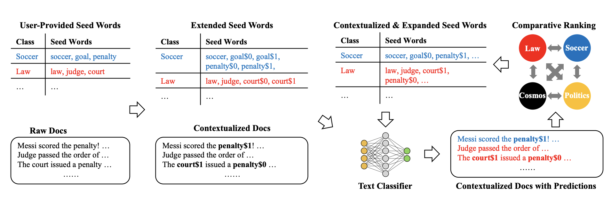

# ConWea: Contextualized Weak Supervision for Text Classification

- [Model](#model)
- [Training](#training)
	- [Required Inputs](#required-inputs)
	- [Commands](#commands)
	- [Requirements](#requirements)
- [Citation](#citation)

## Model



## Training

### Required inputs
Each Dataset should contain following files:
- **DataFrame pickle file**
  - Example: ```data/nyt/df.pkl```
    - This dataset should contain two columns named ```sentence```, ```label```
    - ```sentence``` contains text and ```label``` contains its corresponding label.
    - Must be named as ```df.pkl```
- **Seed Words Json file**
  - Example: ```data/nyt/seedwords.json```
    - This json file contains seed words list for each label.
    - Must be named as ```seedwords.json```

### Commands


#### Corpus Contextualization: 
The ```contextualize.py``` requires three arguments: ```dataset_path```, which is a path to dataset containing 
required DataFrame and seedwords, ```temp_dir``` is a path to a temporary
directory which is used for dumping intermediate files during contextualizing the corpus, and ```gpu_id``` refers to the 
id of the gpu. If not mentioned, the process runs on cpu.
To contextualize the corpus, please run:
```shell script
$ python contextualize.py --dataset_path dataset_path --temp_dir temp_dir_path --gpu_id 3
```

The ```tests/test_contextualize.py``` is a unittest to check the sanity of contextualization. To run this unittest, please execute:
```shell script
$ python -m unittest tests/test_contextualize.py
``` 
 
#### ConWea - Iterative Framework:
The ```train.py``` requires two arguments: ```dataset_path```, which is a path to dataset containing 
required contextualized corpus DataFrame dumped by ```contextualize.py``` and seed words, and ```gpu_id``` refers to the 
id of the gpu. If not mentioned, 
the process runs on cpu.
To train ConWea, please run:
```shell script
$ python train.py --dataset_path dataset_path --gpu_id 3
```

The ```tests/test_conwea.py``` is a unittest to check the sanity of framework. To run this unittest, please execute:
```shell script
$ python -m unittest tests/test_conwea.py
``` 


### Requirements

This project is based on ```python==3.7```. The dependencies are as follow:
```
keras-contrib==2.0.8
scikit-learn==0.21.3
flair==0.4.4
scipy=1.3.1
gensim==3.8.1
numpy==1.17.2
```

## Citation

```
@inproceedings{mekala-shang-2020-contextualized,
    title = "Contextualized Weak Supervision for Text Classification",
    author = "Mekala, Dheeraj  and
      Shang, Jingbo",
    booktitle = "Proceedings of the 58th Annual Meeting of the Association for Computational Linguistics",
    month = jul,
    year = "2020",
    address = "Online",
    publisher = "Association for Computational Linguistics",
    url = "https://www.aclweb.org/anthology/2020.acl-main.30",
    pages = "323--333",
    abstract = "Weakly supervised text classification based on a few user-provided seed words has recently attracted much attention from researchers. Existing methods mainly generate pseudo-labels in a context-free manner (e.g., string matching), therefore, the ambiguous, context-dependent nature of human language has been long overlooked. In this paper, we propose a novel framework ConWea, providing contextualized weak supervision for text classification. Specifically, we leverage contextualized representations of word occurrences and seed word information to automatically differentiate multiple interpretations of the same word, and thus create a contextualized corpus. This contextualized corpus is further utilized to train the classifier and expand seed words in an iterative manner. This process not only adds new contextualized, highly label-indicative keywords but also disambiguates initial seed words, making our weak supervision fully contextualized. Extensive experiments and case studies on real-world datasets demonstrate the necessity and significant advantages of using contextualized weak supervision, especially when the class labels are fine-grained.",
}
```